# Skin Estuary MOD V2 for KODI 21 Omega KN Edition #

**Some screenshots You'll find at the end of this Readme**

## Installation Notes ##

It's strongly recommended to install the skin via the "Kodinerds Repo", as this is the only way to guarantee that additional 
required modules (e.g. the PVR Artwork Module) are also installed. Another advantage is that you get automatic updates when 
you install an addon from a repository and not from ZIP.

To install the Kodinerds repository visit the page "https://repo.kodinerds.net", download the repository zip (red button) 
and install it. After that you can install the skin directly from the repository under "Look & Feel", "Skins".

## Installation from Git ##

If you want to install the latest version from Git (before this has added to Kodinerds Repo) just download the Addon from here 
https://github.com/b-jesch/skin.estuary.modv2/tree/Omega (green Code button), **rename the root folder inside the ZIP** 
from ```skin.estuary.modv2-Omega``` to ```skin.estuary.modv2``` and choose 'install from zip' inside Kodi. **Renaming 
the root folder inside the ZIP needs unpacking/packing the zip in some cases.**

### File name flagging ###
If you want to use special flags like HDR or Dolby Vision or special 3D formats you have to name your files with proper tags, 
preferably before the file extension: 

| 3D with <br> stereoscopic detection |           MVC codec            |          Side by Side          |         Top and Bottom         |
|:-----------------------------------:|:------------------------------:|:------------------------------:|:------------------------------:|
|          |  |  |  |
|             no tagging              |             3d.mvc             |             3d.sbs             |             3d.tab             |


The Video resolution type recognition by filename for HDR(+)/HLG/Dolby Vision has been removed.

### Animated Artwork ###

As the setup of animated artwork was done by skinhelper addon (which was removed from skin) the addon "Animated Artwork Module" has now taken 
the management of those artwork. Animated artwork has some limitations (see Kodi Wiki: https://kodi.wiki/view/Artwork_types#Animated_Artwork). 
To get this feature work properly, you have to assign a folder within the addon settings, which contains all the artwork. This 
folder **must** be a folder of your local filesystem. You can use network share, but this **must** be mounted to a local mountpoint.
Put all your artwork into this folder. Subfolders are allowed (without nesting).  

If you navigate in your movie library, you'll have a new entry now to (re)assign animated Artwork in the context menu. The skin
supports animated poster only.

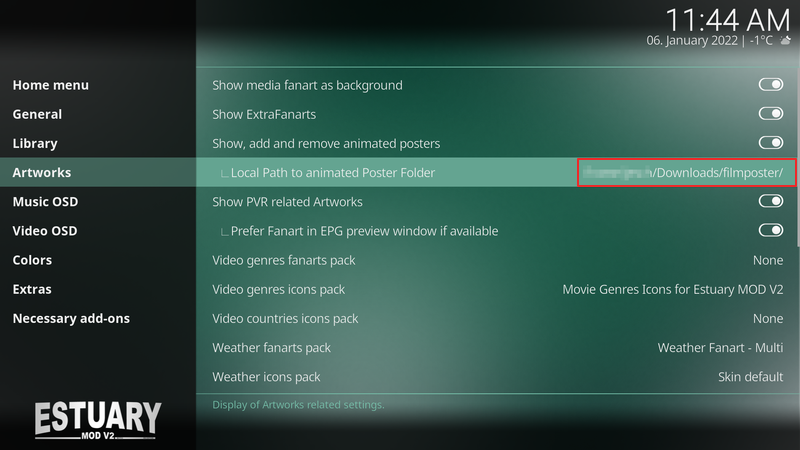
### 21.2.1+omega ###
- .12
  * "Last updated TV Shows" to TV Show Widgets added
  * some issues with content related background images in video addons fixed, settings for background fanart and extra fanart improved
  * Infolabel VideoPlayer.AudioBitrate as Fallback to Player Process Info added
  * minor fixes and improvements


- .11
  * disable seasonals on picture slideshow
  * show bitrate/samplerate in music OSD
  * seen flag of movies in flix view added
  * smaller improvements and fixes


- .10
  * Player Process Info extended (regular Kodi builds)
  * Introducing Player Process Info for Amlogic CPM builds (CoreELEC) (DV/HDR)


- .9
  * Player Process Info improved
  * Runtime (mins) of media files in list views added (file mode)
  * Visibility conditions of showing splash screen depending on startup action in skin settings fixed
  * Info View in PVR channels panel fixed


- .8
  * smaller issues fixed
  * show dts-x/atmos flags on video OSD only when these streams are selected (thanks Frodo19)


- .7
  * some smaller artwork issues in several views fixed pt.2


- .6
  * some smaller artwork issues in several views fixed


- .5
  * exclude special plugin from size calculation in helpers.py
  * Code cleanup
  * Some issues in Gallery view fixed
  * unnecessary video flags removed when playing PVR radio stations
  * service interval of view switcher increased


- .4
  * Info panel of PVR guide list views improved
  * some fixes for jump2letter conditions adapted


- .3
  * improved adjustments of category widget items in home menu
  * vertical slide of personal widget panels removed


- .2
  * Info labels to player process info added
  * Visibility condition of items in media menu side blade fixed (PVR, EPG)
  * Visibility of "Browse" item in home widgets are now conditional depending on info/play setting of widget 
  * HDRplus detection by filename added (expects .hdrplus. in filename)


- .1
  * smaller improvements for touch mode


- .0
  * Videoversion/-selection, DialogSelect fixed
  

### 21.2.0+omega ###
- .19
  * Improvements on video set info window (1132) added 
  * condition variables of special flags improved


- .18
  * wrong setting status in skin settings fixed
  * not working option for showing fanart in music visualization fixed
  * Conditional loading of code depending on script.embuary.* modified
  

- .17
  * smaller top bar overlay, lyrics background in fullscreen added
  * Improvements of video versions selection 


- .16
  * extend watched/unwatched marker settings with off option
  * Parental Rating label of PVR client in Video OSD included 


- .15
  * show year of release depending on skin settings in Live TV OSD main label
  * skin shortcuts favourite (overrides.xml) modified
  * now/next Up in Cinemas to movie widget added 
  * Display FPS to player process info added
  * unwatched/total marker added to widgets. Configure them in skin settings


- .14
  * Condition visibility of OSD fixed (Youtube recommended channels)
  * channelswitch options reverted back (Nexus behaviour)
  * Genre IDs to genre info (EPG grid view) added, special genre labels from skin removed
  * new customized genres added, genre colors selection extended to off/default/custom


- .13
  * missing condition for labels in wall view fixed
  

- .12
 * Channel manager, channel group manager fixed

  
- .11
  * visibility condition of top bar overlay fixed
  * setting for showing video sizes in list views implemented


- .10
  * visibility of cd art in music osd modified
  * PVR widget update on content changes (info update) implemented


- .9
  * status overlays partial reverted
  

- .8
  * Subtitle flags in info views fixed
  * Visibility condition of rotating disc art in video/audio OSD fixed
  * in progress tvshows widget moved to top
  * Video resolution to list views added


- .7
  * Title position on timeshift in music OSD fixed (PVR Radio)
  * Visibility of EDL and Cuts in seek bar fixed
  * Year from list views removed if year is shown behind title
  

- .6
  * Jump2Letter for Interprets (music videos) implemented
  * Option for showing rating flags in video info added
  * Chinese language strings added

  
- .5
  * condition visibility of episode thumbs depending on watch status fixed (startup)
  * colored icons redesigned (thanks to frodo19)
  * minor improvements in video version selection dialog


- .4
  * visibility conditions of ratings extended to video info flags
  * settings of 'hide for spoiler', 'hide episode thumb of unseen episodes' removed from skin settings
    (use 'settings, media, videos, show information for unwatched items' instead)
  * setting for default selection of OSD button added (Stop, Play/Pause)
  * background glitch on fullscreen video info fixed
  

- .3
  * Debug controls to skin settings extras added
  * Dialog select window of video versions improved
  * added option showing CD replacement when primal CD art is not available 
  * some visible conditions of tv show widgets (Home) depends on Embuary helper/info implemented
  * Frame skip (FrameAdvance) implemented
  * Skin Setting of video resolution timings on video startup improved


- .2
  * missing condition of showing disc art on visualisations fixed
  * following improvements of the video versions implementation progress
  * black screen mode while music playing improved (hide OSD independent of OSD info setting)
  * Addon status symbols to addon lists added 
  * customizable background to pvr radio station logos added (OSD)
  * visible condition of audio channel count flag reversed


- .1
  * Movie version item to movie category widget added
  * function 'getKodiSetting' to helper added
  * several issues with video infos fixed
  * slide animation fixed if custom widgets are used


- .0
  * code improvements of rotating media (CD/DVD/BluRay) in Video-/Audio OSD
  * active colors to buttons (dim, random playback) added - audio OSD
  * improved lyrics scrolling text view (cu-lrclyrics) 
  * calculate function to helpers.py added
  * improved process info dialog
  * calculate function of embuary helper with own function in video info dialog replaced
  * embuary helper addon from mandatory addons removed
  * introducing movie versions management 


- .1
  * Flag "added to library" added
  * Bug in video OSD fixed
  * smaller code changes
  * slovakian language strings updated


- .0
  * Media flags completely revised (uniform size and improved common code basis)
  * missing music info on radio broadcasts fixed


### 21.0.0+omega ###
- .9 
  * some icons added
  * Code Improvements on full video OSD
  * OSD media flags fixed/improved
  * remove switching channel options (PVR)
  * Option added for hiding SIG/SNR flags if not provided by Backend Driver (returns always zero)


- .8
  * fix several position adjustments on small Video OSD
  * add PVR device number flag if PVR stream device has numbered (#x) labels
  

- .7
  * remove obsolete DialogFavourites.xml
  * fade out extended progress bar when music visualisation is active
  * some seasonal backgrounds changed
  * add more busy spinners
  * add missing font definition
  

- .6
  * show PVR SIG and SNR flags only when LiveTV or Radio is playing
  * add "More" folder for dynamic content containers (home screen)
  * fix pvr targets in home screen widgets


- .5
  * added several busy spinners
  * update deprecated player info
  * improved OSD code grouping, replace filenames with window names


- .4
  * revert back extra info on cast list
  * fix wrong actors list showing on movies with same titles but different year   
  * add Internet Connection Status to Home screen
  * Merge PR #130 (disappearing side panel on busy spinner)
  * add custom colors to battery level indicator (selectable via skin settings)
  * customize text shadow color in skin settings
  * improvements in embuary dialogs
  * introducing time display selection on music OSD/Skin settings
  * fix navigation issues on several OSD dialogs
  * introducing new dynamic default CD cover (music OSD)
  * introducing speed in-/decrease buttons in video OSD


- .3
  * improved scrollbars
  * add title and year info to wall view items
  * disable autoclose OSD when touchmode is selected
  * improved background image handling (issue #128) 


- .2
  * add support for PreShowExperience
  * add TV Show count/seen/unseen to settings shortcut widget
  * improved actors list in video info

- .1
  * Introducing battery level indicator
  * Update Player Process Info (again thanks to frodo19)
  * Move Chapter/Cutmarkers to seekbar
  * Option "Hide notifications while Playback" removed
  * Fix missing video genre fanart even if fanart pack is installed
  * add runtime (duration) to PVR search results, minor improvements
  * add a resume button to video info (DialogVideoInfo.xml)


- .0
  * initial commit
  * add animation to PVR NextUp
  * reverted image type back to multiimage for weather widget

 
### Screenshots ###

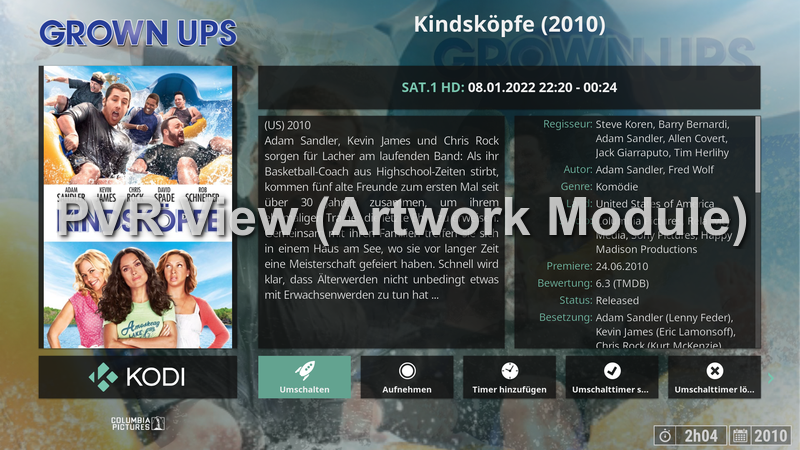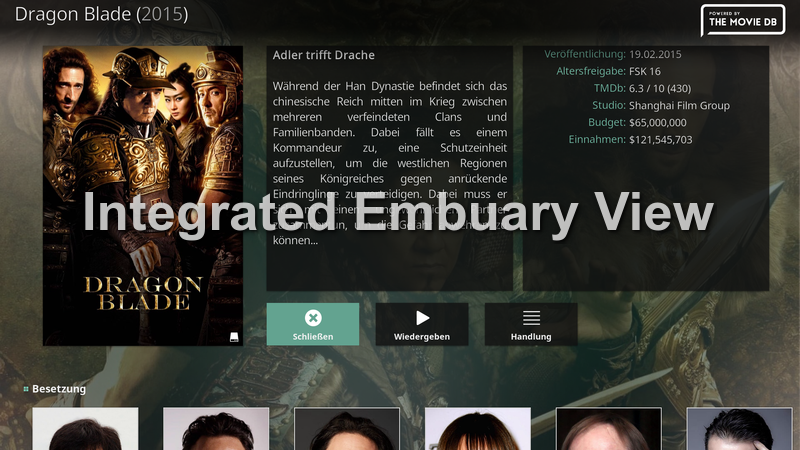
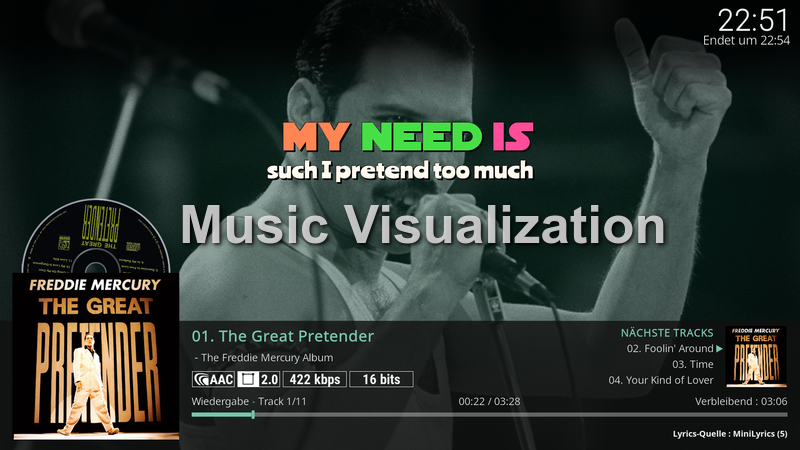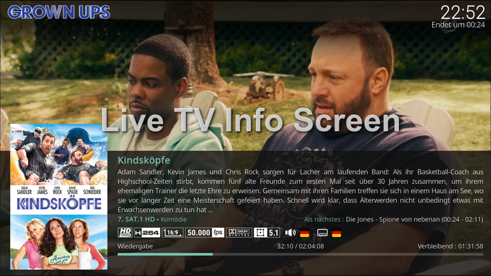
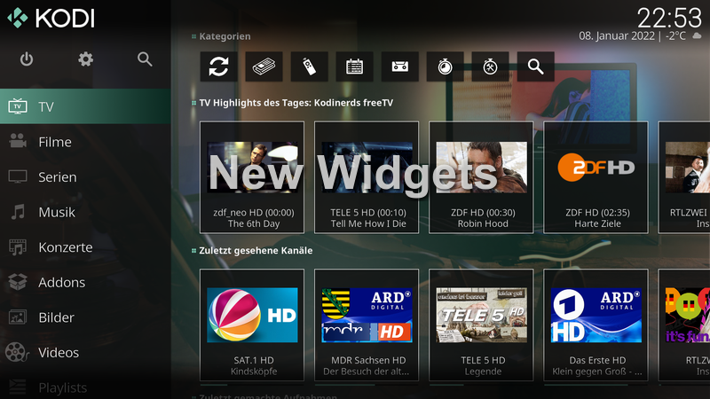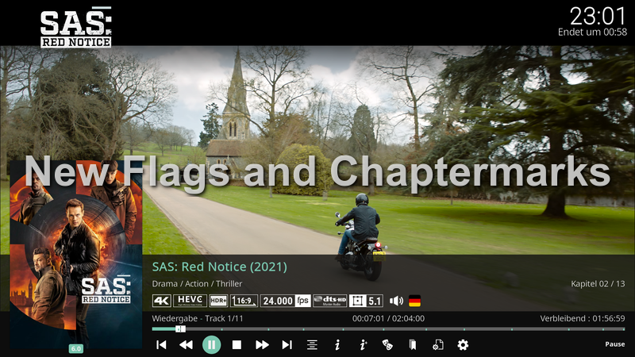
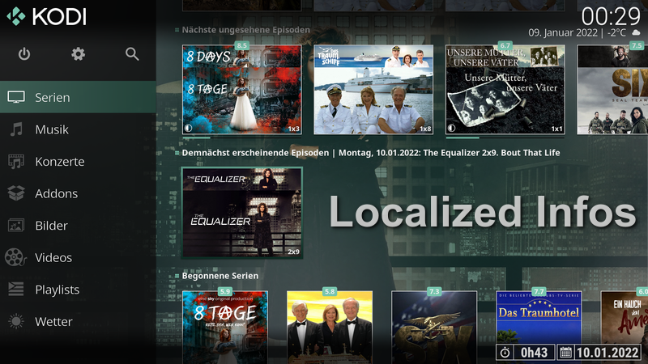
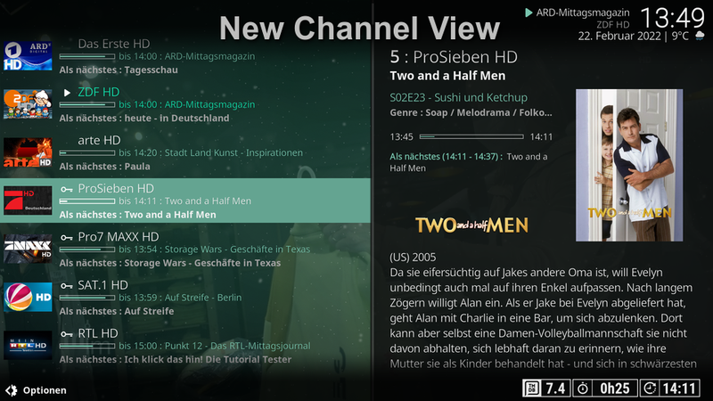
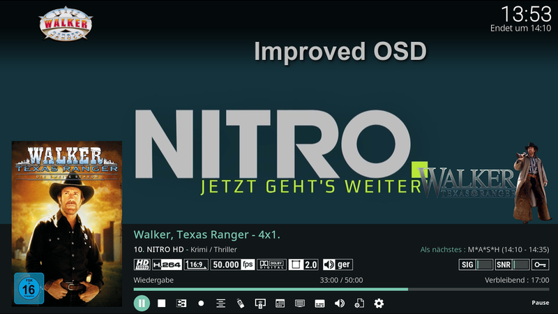
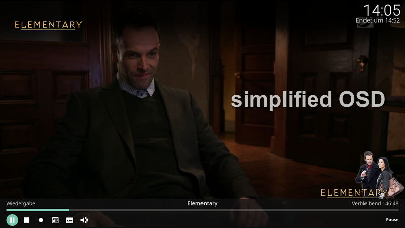
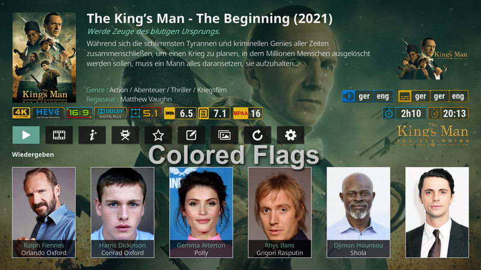
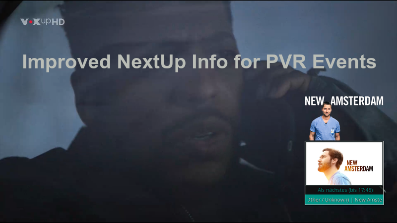
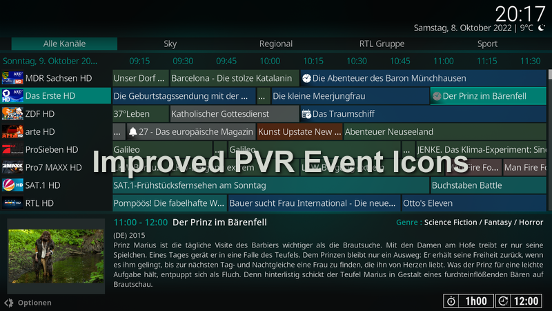
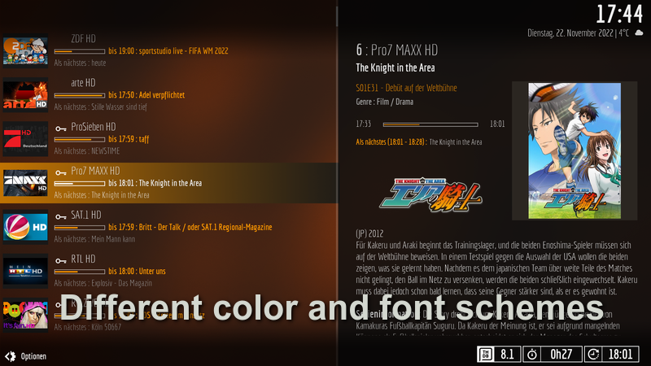
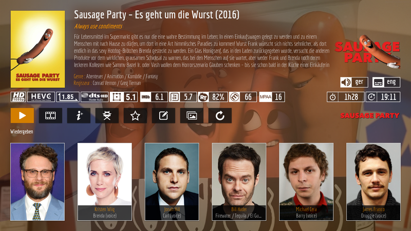
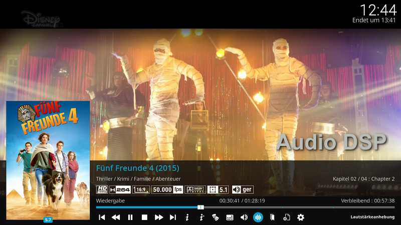
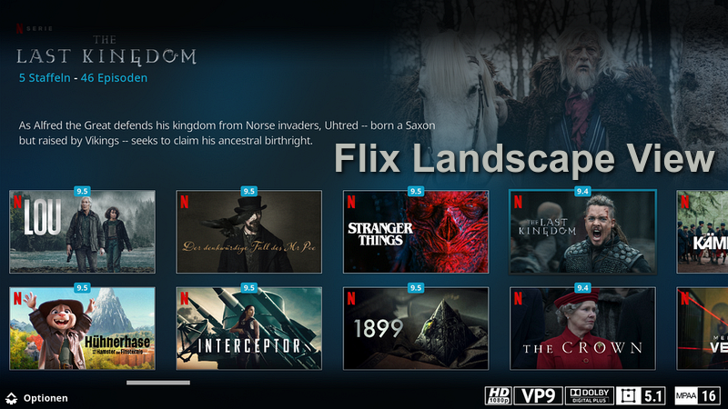
